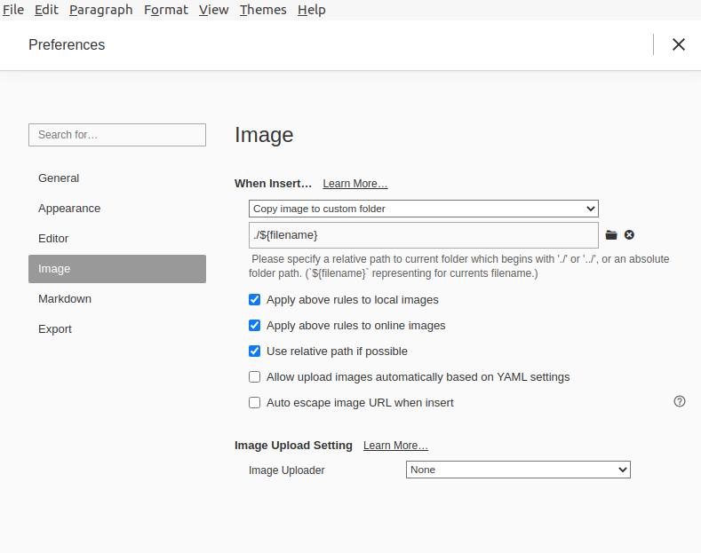

# Hexo + Typora 图片路径同步

## 1. 修改_config.yml 

```
post_asset_folder: true
```

## 2. 修改Typora配置



如图配置Typora图片路径

## 3. 安装插件

```
npm install hexo-asset-image --save
```

安装该插件是为了自动转换图片路径为博客支持格式

打开`/node_modules/hexo-asset-image/index.js`, 使用以下代码替换

```
const log = require('hexo-log')({ 'debug': false, 'slient': false });

/**
 * md文件返回 true
 * @param {*} data 
 */
function ignore(data) {
    var source = data.source;
    var ext = source.substring(source.lastIndexOf('.')).toLowerCase();
    return ['md',].indexOf(ext) > -1;
}

function action(data) {
    var reverseSource = data.source.split("").reverse().join("");
    var fileName = reverseSource.substring(3, reverseSource.indexOf("/")).split("").reverse().join("");

    //   -->  
    var regExp = RegExp("!\\[(.*?)\\]\\(" + fileName + '/(.+?)\\)', "g");
    // hexo g
    data.content = data.content.replace(regExp, "","g");

    // log.info(`hexo-asset-img: filename: ${fileName}, title: ${data.title.trim()}`);
    
    return data;
}

hexo.extend.filter.register('before_post_render',(data)=>{
    if(!ignore(data)){
        action(data)
    }
}, 0);
```

## 4. 插入图片

复制任意图片，在Typora中粘贴，Typora自动生成相对路径图片，hexo部署之后也可以正常显示图片

## 参考

[Hexo + Typora + 开发Hexo插件 解决图片路径不一致](https://moeci.com/posts/hexo-typora/)
